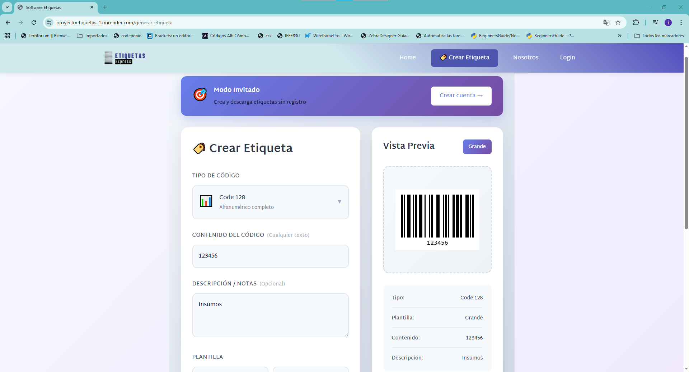

# 🏷️ Etiquetas Express

> Generador profesional de códigos de barras con múltiples formatos y plantillas personalizables.

[](https://proyectoetiquetas-1.onrender.com)
[](LICENSE)
[](https://nodejs.org)

---

## 📸 Preview



---

## ✨ Características

### 🎯 Funcionalidades Principales

- **7 Tipos de Códigos Soportados**

  - Code 128
  - Code 39
  - EAN-13
  - EAN-8
  - QR Code
  - Data Matrix
  - PDF417

- **5 Plantillas Predefinidas**

  - Clásica
  - Compacta
  - Grande
  - Industrial
  - Minimalista

- **Vista Previa en Tiempo Real**: Visualiza tu etiqueta mientras la creas
- **Validación Automática**: Verifica el formato correcto para cada tipo de código
- **Descarga Instantánea**: Exporta en PNG de alta calidad
- **Sin Registro Requerido**: Comienza a crear inmediatamente
- **Almacenamiento Local**: Guarda tus etiquetas en el navegador

---

## 🛠️ Stack Tecnológico

### Frontend

- **React** 18.x - Librería UI
- **React Router** - Navegación SPA
- **CSS3** - Estilos personalizados
- **JsBarcode** - Generación de códigos de barras
- **QRCode.js** - Generación de códigos QR
- **Vite** - Build tool

### Backend

- **Node.js** - Runtime
- **Express.js** - Framework web
- **MySQL** - Base de datos
- **dotenv** - Gestión de variables de entorno
- **CORS** - Manejo de peticiones cross-origin

### Infraestructura

- **Render** - Hosting (Web Service)
- **CleverCloud** - Base de datos MySQL
- **GitHub** - Control de versiones

---

## 🚀 Instalación y Configuración

### Prerrequisitos

```bash
node >= 16.0.0
npm >= 8.0.0
```

### 1. Clonar el repositorio

```bash
git clone https://github.com/andrewortiz89/proyectoEtiquetas.git
cd proyectoEtiquetas
```

### 2. Configurar Backend

```bash
cd backend
npm install
```

Crea un archivo `.env` en la carpeta `backend/`:

```env
# Base de Datos MySQL
MYSQL_ADDON_HOST=tu-mysql-host
MYSQL_ADDON_DB=tu-base-datos
MYSQL_ADDON_USER=tu-usuario
MYSQL_ADDON_PASSWORD=tu-contraseña
MYSQL_ADDON_PORT=3306

# Servidor
PORT=3000
NODE_ENV=development

# JWT
JWT_SECRET=tu-secreto-jwt

# CORS
FRONTEND_URL=http://localhost:5173
```

### 3. Configurar Frontend

```bash
cd frontend/proyecto
npm install
```

Crea un archivo `.env` en la carpeta `frontend/proyecto/`:

```env
VITE_API_BASE=http://localhost:3000/api
```

### 4. Configurar Base de Datos

Ejecuta el siguiente script SQL en tu base de datos MySQL:

```sql
-- Crear tabla usuarios
CREATE TABLE usuarios (
  id INT AUTO_INCREMENT PRIMARY KEY,
  email VARCHAR(255) NOT NULL UNIQUE,
  contraseña VARCHAR(255) NOT NULL,
  nombre VARCHAR(255),
  created_at TIMESTAMP DEFAULT CURRENT_TIMESTAMP,
  updated_at TIMESTAMP DEFAULT CURRENT_TIMESTAMP ON UPDATE CURRENT_TIMESTAMP
) ENGINE=InnoDB DEFAULT CHARSET=utf8mb4;

-- Crear tabla plantillas
CREATE TABLE plantillas (
  id INT AUTO_INCREMENT PRIMARY KEY,
  nombre VARCHAR(100) NOT NULL UNIQUE,
  descripcion TEXT,
  ancho INT DEFAULT 400,
  alto INT DEFAULT 200,
  configuracion JSON,
  activa BOOLEAN DEFAULT TRUE,
  created_at TIMESTAMP DEFAULT CURRENT_TIMESTAMP,
  updated_at TIMESTAMP DEFAULT CURRENT_TIMESTAMP ON UPDATE CURRENT_TIMESTAMP
) ENGINE=InnoDB DEFAULT CHARSET=utf8mb4;

-- Crear tabla etiquetas
CREATE TABLE etiquetas (
  id INT AUTO_INCREMENT PRIMARY KEY,
  nombre VARCHAR(255) NOT NULL,
  codigo VARCHAR(255) NOT NULL,
  tipo_codigo VARCHAR(50) NOT NULL,
  plantilla_id INT,
  usuario_id INT,
  imagen_url VARCHAR(500),
  descripcion TEXT,
  created_at TIMESTAMP DEFAULT CURRENT_TIMESTAMP,
  updated_at TIMESTAMP DEFAULT CURRENT_TIMESTAMP ON UPDATE CURRENT_TIMESTAMP,
  FOREIGN KEY (usuario_id) REFERENCES usuarios(id) ON DELETE SET NULL,
  FOREIGN KEY (plantilla_id) REFERENCES plantillas(id) ON DELETE SET NULL
) ENGINE=InnoDB DEFAULT CHARSET=utf8mb4;

-- Insertar plantillas predefinidas
INSERT INTO plantillas (nombre, descripcion, ancho, alto) VALUES
('Clásica', 'Plantilla estándar con información completa', 400, 200),
('Compacta', 'Plantilla pequeña para espacios reducidos', 300, 150),
('Grande', 'Plantilla amplia para más información', 500, 250),
('Industrial', 'Diseño robusto para entornos industriales', 450, 220),
('Minimalista', 'Diseño limpio y simple', 350, 180);
```

### 5. Iniciar la aplicación

**Terminal 1 - Backend:**

```bash
cd backend
npm start
```

**Terminal 2 - Frontend:**

```bash
cd frontend/proyecto
npm run dev
```

La aplicación estará disponible en:

- Frontend: http://localhost:5173
- Backend: http://localhost:3000

---

## 📁 Estructura del Proyecto

```
proyectoEtiquetas/
├── backend/
│   ├── routes/
│   │   └── etiquetasRoutes.js
│   ├── db.js
│   ├── server.js
│   ├── package.json
│   └── .env
├── frontend/
│   └── proyecto/
│       ├── src/
│       │   ├── components/
│       │   ├── assets/
│       │   ├── App.jsx
│       │   ├── Home.jsx
│       │   ├── Home.css
│       │   └── main.jsx
│       ├── package.json
│       └── .env
├── .gitignore
├── README.md
└── LICENSE
```

---

## 🌐 Deploy en Producción

### Backend en Render

1. Conecta tu repositorio de GitHub a Render
2. Configura el servicio:
   - **Build Command**: `npm install`
   - **Start Command**: `npm start`
   - **Root Directory**: `backend`
3. Agrega las variables de entorno
4. Deploy

### Frontend

El frontend puede desplegarse en:

- Vercel
- Netlify
- Render (Static Site)

---

## 🎨 Casos de Uso

- **Retail**: Etiquetas para productos y precios
- **Logística**: Códigos de seguimiento y paquetería
- **Inventario**: Control de stock y almacén
- **Eventos**: Tickets y pases de entrada
- **Manufactura**: Identificación de componentes

---

## 🔒 Seguridad

- ✅ Variables de entorno para credenciales sensibles
- ✅ Validación de entrada en formularios
- ✅ CORS configurado
- ✅ Conexión segura a base de datos
- ⚠️ **Recomendación**: Implementar bcrypt para hash de contraseñas
- ⚠️ **Recomendación**: Implementar JWT para autenticación

---

## 🚧 Roadmap

- [ ] Autenticación con JWT
- [ ] Hash de contraseñas con bcrypt
- [ ] Subida de imágenes para etiquetas personalizadas
- [ ] Generación de etiquetas en lote
- [ ] API REST completa
- [ ] Panel de administración
- [ ] Temas claro/oscuro
- [ ] Exportación en múltiples formatos (PDF, SVG)
- [ ] Historial de etiquetas generadas
- [ ] Compartir etiquetas por enlace

---

## 🤝 Contribuciones

Las contribuciones son bienvenidas. Por favor:

1. Fork el proyecto
2. Crea una rama para tu feature (`git checkout -b feature/AmazingFeature`)
3. Commit tus cambios (`git commit -m 'Add: nueva funcionalidad'`)
4. Push a la rama (`git push origin feature/AmazingFeature`)
5. Abre un Pull Request

---

## 📝 Licencia

Este proyecto está bajo la Licencia MIT. Ver el archivo [LICENSE](LICENSE) para más detalles.

---

## 👨‍💻 Autor

**Andres Ortiz**

- GitHub: [@andrewortiz89](https://github.com/andrewortiz89)
- LinkedIn: [(https://www.linkedin.com/in/jeyson-andres-ortiz-mendoza-soft-development/)]
- Portfolio: [(https://sage-aunt-9b2.notion.site/PORTAFOLIO-2b7bc3555e0a806d89d4f81e90ef95a2?source=copy_link)]

---

## 🙏 Agradecimientos

- [JsBarcode](https://github.com/lindell/JsBarcode) - Librería de códigos de barras
- [React](https://reactjs.org/) - Framework UI
- [Render](https://render.com/) - Hosting
- [CleverCloud](https://www.clever-cloud.com/) - Base de datos

---

## 📞 Soporte

Si encuentras algún problema o tienes sugerencias:

1. Abre un [Issue](https://github.com/andrewortiz89/proyectoEtiquetas/issues)
2. Contacta al autor

---

<div align="center">

**⭐ Si este proyecto te fue útil, considera darle una estrella ⭐**

Hecho por Andres Ortiz

</div>
